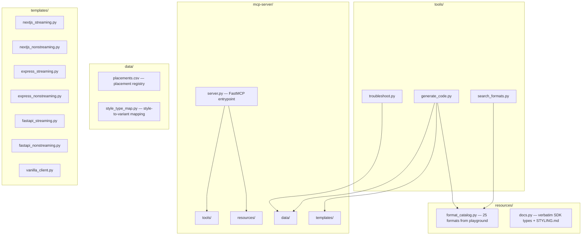

# Gravity MCP Server

## Architecture




## File structure

```
gravity-main/
  mcp-server/
    server.py                      # FastMCP entrypoint
    pyproject.toml                 # uv project: fastmcp dependency
    tools/
      __init__.py
      search_formats.py            # search_formats tool
      generate_code.py             # generate_code tool + CSV write
      troubleshoot.py              # troubleshoot tool
    resources/
      __init__.py
      format_catalog.py            # 25 format defs (code from playground)
      docs.py                      # verbatim SDK docs as resource templates
    data/
      __init__.py
      placements.csv               # placement registry (created at runtime)
      style_type_map.py            # style -> type mapping dict
      troubleshoot_kb.py           # curated symptom -> diagnosis entries
    templates/
      __init__.py
      nextjs_streaming.py
      nextjs_nonstreaming.py
      express_streaming.py
      express_nonstreaming.py
      fastapi_streaming.py
      fastapi_nonstreaming.py
      vanilla_client.py
```

## Phase 1 scope (this implementation)

### 1. Project scaffold

Create `mcp-server/` at the repo root with `pyproject.toml`:

```toml
[project]
name = "gravity-mcp-server"
version = "0.1.0"
requires-python = ">=3.11"
dependencies = ["fastmcp>=3.0"]
```

### 2. `server.py` — FastMCP entrypoint

- Instantiate `FastMCP` with `name="Gravity Ads Integration"`, `stateless_http=True`
- Server `instructions` describe the server's purpose concisely
- Register the 3 tools and resource templates from their modules
- Health check custom route at `/health`
- `mcp.run(transport="http", host="0.0.0.0", port=8000)` in `__main__`

### 3. Format catalog (`resources/format_catalog.py`)

A Python dict of all 25 formats. Each entry contains:

- `name`: format name (e.g., `"floating"`)
- `description`: one-line description (e.g., `"Elevated card with prominent shadow"`)
- `type`: the SDK variant it maps to (e.g., `"card"`)
- `code`: the exact JSX snippet from the playground (verbatim, tested)
- `omits`: list of fields the layout omits (e.g., `["title", "cta"]`)

This is a static data module. No generation, no AI — just the 25 entries from [https://react-sandbox.trygravity.ai](https://react-sandbox.trygravity.ai) with their literal code.

### 4. Style-to-type mapping (`data/style_type_map.py`)

Static dict mapping each of the 25 style names to their SDK variant:

```python
STYLE_TYPE_MAP = {
    "card": "card",
    "floating": "card",
    "glass": "card",
    "outlined": "card",
    "tinted": "card",
    "accent": "accent",
    "embed": "embed",
    "side-panel": "side-panel",
    "split-action": "split-action",
    "labeled": "labeled",
    "bubble": "bubble",
    "compact-bar": "inline",
    "notification": "notification",
    "tooltip": "tooltip",
    "banner": "banner",
    "toolbar": "toolbar",
    "pill": "pill",
    "divider": "divider",
    "suggestion": "suggestion",
    "native": "native",
    "quote": "quote",
    "minimal": "minimal",
    "footnote": "footnote",
    "text-link": "text-link",
    "hyperlink": "hyperlink",
}
```

### 5. Tool: `search_formats`

File: `tools/search_formats.py`

Parameters:

- `query: str | None` — natural language or keyword filter
- `category: str | None` — filter by type (e.g., `"card"`, `"inline"`, `"notification"`)
- `detail: Literal["names", "summary", "full"]` — progressive disclosure, default `"summary"`

Logic:

1. Load catalog from `format_catalog.py`
2. Filter by `category` (exact match on `type`) if provided
3. Filter by `query` (substring match on `name` + `description`) if provided
4. Return based on `detail` level:
  - `"names"` — list of format names only
  - `"summary"` — list of `{name, description, type}` dicts
  - `"full"` — list of `{name, description, type, code, omits}` dicts

No side effects. Pure read.

### 6. Tool: `generate_code`

File: `tools/generate_code.py`

Parameters:

- `format: str` — one of the 25 format names
- `framework: Literal["nextjs", "express", "fastify", "fastapi", "vanilla"]`
- `streaming: bool` — SSE streaming or JSON response
- `theme: Literal["light", "dark"] | None` — optional dark mode preset
- `customizations: str | None` — natural language style description for the LLM to apply

Logic:

1. Validate `format` against `STYLE_TYPE_MAP`; return error if unknown
2. Look up the format's code snippet from the catalog
3. Look up the server template for `framework` + `streaming` combination
4. Generate a UUID v4 `placement_id`
5. Inject the `placement_id` into the server template's `placement_id` field
6. If `theme == "dark"`, append the dark mode `slotProps` recipe from STYLING.md
7. Append the format's client-side code snippet
8. Write a row to `data/placements.csv`:
  - `placement_id, style, type, framework, platform, performance, created_at`
  - `platform` hardcoded to `"web"`, `performance` left empty
9. Return: `{ placement_id, style, type, framework, platform, performance, server_code, client_code }`

The server templates (in `templates/`) are hand-authored, complete, working code blocks. Each one includes:

- Correct imports for the framework
- `gravityContext()` on the client side
- `production: true` comment flagged
- `getAds()` / `get_ads()` call with the `placement_id` embedded
- Impression tracking (for vanilla client template, explicit `impUrl` GET)
- The `getAds()` never-throws note as a code comment

Template example for `nextjs_streaming.py` — a Python string containing the tested TypeScript code from the hardwired prompt, parameterized with `{placement_id}` and `{format_code}` slots that `generate_code` fills in.

### 7. Tool: `troubleshoot`

File: `tools/troubleshoot.py`

Parameter: `symptom: str`

Logic:

1. Load the curated knowledge base from `data/troubleshoot_kb.py`
2. Match `symptom` against known entries (case-insensitive substring match on symptom keywords)
3. Return the matching entry: `{ symptom, cause, fix, reference_url }`
4. If no match, return a generic "contact support" response with the top 5 known symptoms listed

Knowledge base entries (curated from the hardwired prompt and SDK behavior):

- `"no ads" / "empty response"` — Missing GRAVITY_API_KEY or key invalid
- `"401"` — API key invalid or revoked
- `"test ads only" / "no revenue"` — `production: true` not set
- `"impressions not tracking" / "no payout"` — `impUrl` GET not firing; check IntersectionObserver or manual firing
- `"impression expired"` — `impUrl` must be fired within 5 minutes
- `"CORS"` — Client-side fetch hitting the Gravity API directly instead of server-side
- `"timeout"` — Increase `timeoutMs`; check if ad request is awaited before SSE ends
- `"clickUrl vs url"` — Must link to `ad.clickUrl`, not `ad.url`
- `"gravityContext missing"` — Client not sending `gravity_context` in request body
- `"wrong placement"` — Only allowed: `above_response`, `below_response`, `inline_response`, `left_response`, `right_response`

### 8. Resource templates

File: `resources/docs.py`

Register parameterized resource templates with FastMCP:

- `gravity://formats` — Index: returns all 25 format names + one-line descriptions
- `gravity://formats/{name}` — Full detail for one format (code, type, omits)
- `gravity://docs/{topic}` — One doc section per topic

Doc topics and their content source (verbatim from the SDK source files):

- `ad-response` — The `Ad` TypeScript interface from [sdk-js/packages/api/types.ts](sdk-js/packages/api/types.ts) lines 160-177
- `styling` — Full content of [sdk-js/packages/react/STYLING.md](sdk-js/packages/react/STYLING.md)
- `react-component` — `GravityAdProps`, `GravityAdSlotProps`, `AdResponse`, `AdTextProps` from [sdk-js/packages/react/src/types.ts](sdk-js/packages/react/src/types.ts)
- `server-sdk` — The `Gravity` class + `gravityAds()` function signatures and JSDoc from [sdk-js/packages/api/gravity.ts](sdk-js/packages/api/gravity.ts) and [sdk-js/packages/api/ads.ts](sdk-js/packages/api/ads.ts)
- `placement-policy` — The `Placement` type from the API types + the rule "adjacent to AI content only"
- `checklist` — Hand-authored verification steps (API key, test ads, component renders, impUrl fires, production flag)
- `python-sdk` — The `Gravity` class from [sdk-py/src/gravity_sdk/_client.py](sdk-py/src/gravity_sdk/_client.py) — function signatures and docstrings

### 9. Prompt template

Register one prompt with FastMCP:

`integrate_gravity_ads(framework: str, format: str)` — a reusable prompt that guides the LLM through: detect the publisher's stack, call `search_formats` to pick a format, call `generate_code` to get paired server+client code, apply customizations, and verify with the checklist resource.

### 10. CSV placement registry

File: `data/placements.csv`

Created on first write by `generate_code`. Schema:

```
placement_id,style,type,framework,platform,performance,created_at
```

- `placement_id`: UUID v4
- `style`: format name from catalog (e.g., `"floating"`)
- `type`: SDK variant (e.g., `"card"`)
- `framework`: `"nextjs"`, `"express"`, `"fastapi"`, etc.
- `platform`: `"web"` (hardcoded)
- `performance`: empty string (populated in Phase 2)
- `created_at`: ISO 8601 timestamp

Write uses `csv` stdlib with file locking (`fcntl.flock`) for safety.

### 11. Testing plan

Testing has 4 layers: environment setup, unit tests, manual smoke tests, and end-to-end Cursor testing.

#### 11a. Environment setup

First, fix the `uv` PATH issue. The installer put `uv` in `~/.local/bin` but zsh does not have it in PATH:

```bash
# Add to ~/.zshrc
export PATH="$HOME/.local/bin:$PATH"
# Then reload
source ~/.zshrc
```

Then set up the mcp-server project:

```bash
cd mcp-server
uv sync                          # install fastmcp + deps
uv run python server.py          # verify server starts on port 8000
# Expect: "Uvicorn running on http://0.0.0.0:8000"
```

Verify the health endpoint:

```bash
curl http://localhost:8000/health
# Expect: "OK"
```

#### 11b. Unit tests (`mcp-server/tests/test_tools.py`)

Automated tests that run without the server process. Import the tool functions directly and test them as plain Python functions.

`search_formats` tests:
- `test_names_returns_25` — `detail="names"` returns exactly 25 strings
- `test_summary_has_required_fields` — each entry has `name`, `description`, `type`
- `test_full_has_code` — `detail="full"` entries include `code` and `omits`
- `test_filter_by_category` — `category="card"` returns only card-type formats (card, floating, glass, outlined, tinted)
- `test_filter_by_query` — `query="toast"` matches `notification` (description contains "toast")
- `test_empty_results` — `query="nonexistent"` returns empty list, no error

`generate_code` tests:
- `test_returns_paired_code` — result has both `server_code` and `client_code` non-empty
- `test_placement_id_is_uuid` — `placement_id` is valid UUID v4 format
- `test_csv_write` — after call, `data/placements.csv` contains the new row with correct fields
- `test_placement_id_in_server_code` — the generated `placement_id` appears in `server_code`
- `test_unknown_format_rejected` — `format="nonexistent"` returns an error message
- `test_dark_theme_includes_dark_styles` — `theme="dark"` result includes dark mode slotProps
- `test_all_framework_streaming_combos` — iterate all 6 server combos, verify each returns code

`troubleshoot` tests:
- `test_known_symptom_match` — `"no ads"` returns the API key diagnosis
- `test_case_insensitive` — `"NO ADS"` matches the same entry
- `test_unknown_symptom_fallback` — `"my cat is broken"` returns generic response with top 5 symptoms
- `test_all_entries_reachable` — each KB entry can be reached by at least one keyword

Run with:

```bash
cd mcp-server
uv run pytest tests/ -v
```

#### 11c. Manual smoke tests (`mcp-server/tests/smoke_test.py`)

A script that connects to the running server via FastMCP Client and calls every tool and resource. This tests the full MCP protocol path (HTTP transport, tool registration, serialization).

```bash
# Terminal 1: start the server
cd mcp-server
uv run python server.py

# Terminal 2: run smoke tests
cd mcp-server
uv run python tests/smoke_test.py
```

The smoke test script:

```python
import asyncio
from fastmcp import Client

client = Client("http://localhost:8000/mcp")

async def smoke():
    async with client:
        # 1. search_formats — names
        r = await client.call_tool("search_formats", {"detail": "names"})
        assert "card" in str(r), "FAIL: search_formats names"
        print("PASS: search_formats names")

        # 2. search_formats — summary with query
        r = await client.call_tool("search_formats", {
            "query": "notification", "detail": "summary"
        })
        assert "notification" in str(r), "FAIL: search_formats query"
        print("PASS: search_formats query")

        # 3. search_formats — full
        r = await client.call_tool("search_formats", {
            "query": "floating", "detail": "full"
        })
        assert "slotProps" in str(r), "FAIL: search_formats full has code"
        print("PASS: search_formats full")

        # 4. generate_code — nextjs streaming
        r = await client.call_tool("generate_code", {
            "format": "floating",
            "framework": "nextjs",
            "streaming": True,
        })
        text = str(r)
        assert "placement_id" in text, "FAIL: generate_code missing placement_id"
        assert "server_code" in text or "getAds" in text, "FAIL: generate_code missing server code"
        assert "GravityAd" in text, "FAIL: generate_code missing client code"
        print("PASS: generate_code nextjs streaming")

        # 5. generate_code — dark theme
        r = await client.call_tool("generate_code", {
            "format": "card",
            "framework": "express",
            "streaming": False,
            "theme": "dark",
        })
        assert "#18181B" in str(r) or "dark" in str(r).lower(), "FAIL: dark theme"
        print("PASS: generate_code dark theme")

        # 6. generate_code — unknown format rejected
        r = await client.call_tool("generate_code", {
            "format": "nonexistent",
            "framework": "nextjs",
            "streaming": True,
        })
        assert "error" in str(r).lower() or "unknown" in str(r).lower(), "FAIL: bad format"
        print("PASS: generate_code rejects unknown format")

        # 7. troubleshoot — known symptom
        r = await client.call_tool("troubleshoot", {"symptom": "no ads showing"})
        assert "API" in str(r) or "key" in str(r).lower(), "FAIL: troubleshoot"
        print("PASS: troubleshoot known symptom")

        # 8. troubleshoot — unknown symptom
        r = await client.call_tool("troubleshoot", {"symptom": "random gibberish"})
        assert "contact" in str(r).lower() or "support" in str(r).lower() or "common" in str(r).lower(), "FAIL: troubleshoot fallback"
        print("PASS: troubleshoot fallback")

        # 9. Read resource — format index
        r = await client.read_resource("gravity://formats")
        assert "floating" in str(r), "FAIL: formats index"
        print("PASS: resource gravity://formats")

        # 10. Read resource — single format
        r = await client.read_resource("gravity://formats/banner")
        assert "banner" in str(r).lower(), "FAIL: format detail"
        print("PASS: resource gravity://formats/banner")

        # 11. Read resource — docs topic
        r = await client.read_resource("gravity://docs/ad-response")
        assert "adText" in str(r), "FAIL: docs ad-response"
        print("PASS: resource gravity://docs/ad-response")

        # 12. Verify CSV was written
        import csv
        from pathlib import Path
        csv_path = Path(__file__).parent.parent / "data" / "placements.csv"
        assert csv_path.exists(), "FAIL: placements.csv not created"
        with open(csv_path) as f:
            rows = list(csv.DictReader(f))
        assert len(rows) >= 2, "FAIL: expected at least 2 rows from generate_code calls"
        assert rows[0]["style"] == "floating", "FAIL: first row style"
        print(f"PASS: placements.csv has {len(rows)} rows")

        print("\n--- ALL SMOKE TESTS PASSED ---")

asyncio.run(smoke())
```

#### 11d. End-to-end Cursor test (publisher simulation)

This is the "pretend you're a publisher" test. After the server is running:

1. Add the MCP server to Cursor config at `~/.cursor/mcp.json`:

```json
{
  "mcpServers": {
    "gravity": {
      "url": "http://localhost:8000/mcp"
    }
  }
}
```

2. Restart Cursor (or reload MCP servers)

3. Open any test project (or `sdk-js/examples/react-test/`) and prompt Cursor:

> "I want to integrate Gravity ads into my app. Show me what ad formats are available."

**Expected:** Cursor calls `search_formats` and lists the 25 formats.

4. Follow up:

> "I want a floating card with dark mode. My backend is Next.js with streaming."

**Expected:** Cursor calls `generate_code(format="floating", framework="nextjs", streaming=True, theme="dark")` and returns paired server + client code with a UUID placement_id.

5. Follow up:

> "My ads aren't showing, I'm getting an empty array."

**Expected:** Cursor calls `troubleshoot(symptom="empty array no ads")` and returns the API key diagnosis.

6. After the test, verify `mcp-server/data/placements.csv` has a new row for the floating/nextjs integration.

Checklist for the Cursor test:
- [ ] Cursor discovers the 3 tools on server connect
- [ ] `search_formats` returns correct format list
- [ ] `generate_code` returns code with correct imports for the framework
- [ ] Generated code includes `gravityContext()` on client side
- [ ] Generated code includes `production: true` comment
- [ ] `placement_id` appears in both the return value and the CSV
- [ ] `troubleshoot` returns a relevant diagnosis
- [ ] Resources are readable (check by asking "show me the Ad response interface")

### 12. Run instructions

Add a `README.md` with:

- Fix uv PATH: `export PATH="$HOME/.local/bin:$PATH"` in `~/.zshrc`
- `cd mcp-server && uv sync` to install
- `uv run python server.py` to start locally on port 8000
- MCP endpoint at `http://localhost:8000/mcp`
- Cursor config snippet to connect
- `uv run pytest tests/ -v` to run unit tests
- `uv run python tests/smoke_test.py` to run smoke tests (server must be running)

## Phase 2 (future, not implemented now)

- Migrate CSV to Supabase `ad_placements` table
- Populate `performance` column from Redshift analytics (join on `placement_id`)
- Feed performance data back into `search_formats` recommendations
- Add auth (bearer token per publisher API key)
- Deploy to Prefect Horizon or Cloud Run

